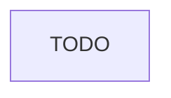

# Bootstrap Modules README

Create or update `modules/README.md` as a maintainer-facing boundary map for package shape, allowed dependency DAG, and forbidden edges.

If the user specifies a different root or file path at the start of this run, use it for this run only.

## Runtime Rules
- Self-contained: skill folder is `.cursor/skills/bootstrap-modules-readme/`; do not use absolute paths from another repo.
- Docs-root heuristic:
  - If `docs/internal/` already exists in the target repo, use it.
  - Else if signals of a public/private split exist (`README.public.md`, `CHANGELOG.public.md`, or `AGENTS.md` referencing `docs/internal/`), only create `docs/internal/` after the user confirms in the override step.
  - Otherwise default to `docs/`.
- Default target: `docs/internal/modules/README.md` when `docs/internal/` exists, otherwise `docs/modules/README.md`.
- Existing files: read first, summarize changes vs scaffold, ask once. Defaults: merge for files, add-only for directories, replace only on explicit request. Never delete user content.
- Thin orchestration: end with the Next hints below.

## Authoring Behavior
- Walk `src/` or the repo's equivalent source root to populate the package tree truthfully. Do not invent directories.
- Distinguish workflow order from import/package dependency graph.
- Use TODO placeholders for user-owned boundaries, layer satellites, glossary terms, and enforcement details not present in code.

## Required Sections
1. Audience and scope: maintainers; not public unless separately published.
2. Package tree: authoritative shape derived from real source layout.
3. Workflow vs package dependency graph note.
4. Allowed dependency edges: Mermaid plus table.
5. Forbidden edges: bullet list with rationale.
6. Enforcement note: point at boundary tests if they exist; otherwise TODO with likely test path.
7. Layer satellites table: layer -> future `layer-<name>.md`, mark `(stub)` if missing.
8. Glossary: repo-specific terms.
9. Migration stance: carve-outs over rewrites; stubs are OK; docs track code.
10. Traceability index: topic -> spec section.

## Scaffold
````md
# Modules

Audience: maintainers. This document records package boundaries and dependency rules.

## Package Tree
TODO: Derive from source layout.

## Workflow vs Dependency Graph
TODO: Explain runtime/workflow order separately from import DAG.

## Allowed Dependency Edges


| From | May Depend On | Rationale |
| --- | --- | --- |
| TODO | TODO | TODO |

## Forbidden Edges
- TODO

## Enforcement
TODO
````

## Next
- Run **bootstrap-agent-index** so the index links here.
- Run **bootstrap-agent-playbooks** so topic playbooks reference these boundaries.
