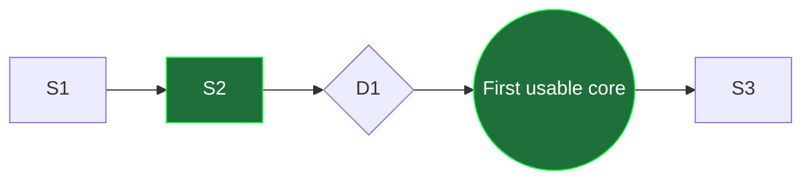

## Reference: Project Status + Slice Report

This file contains the detailed rules and templates for the `project-status-slice-report` skill.

### Guardrails (must follow)

- **No secrets / no PII**: never paste credentials/tokens, customer/user data, real exports, or full logs.
- **Repo-local links only**: relative links to repo files are OK; avoid external links in these docs unless explicitly requested.
- **No machine-local absolute paths**: use repo-relative paths like `src/...`, `tests/...`, `docs/...`.
- **Verification required**: slice reports include exact command(s) run and pass counts; if tests cannot be run, state why and provide a minimal manual verification list.

### Where files live (docs root detection)

Pick one docs root:

- If `docs/internal/` exists, write:
  - `docs/internal/project_status.md`
  - `docs/internal/slice_report/...`
- Else write:
  - `docs/project_status.md`
  - `docs/slice_report/...`

If the repo also contains `docs/public/`, do not duplicate these artifacts into public docs unless explicitly requested.

### Slice system conventions

- Slice IDs: `S1`, `S2`, … (stable).
- Decision diamonds: `D1`, `D2`, … (only when a decision blocks the next slice).
- Milestones: `M1`, `M2`, … (rare; define what “done” means across multiple slices).
- Allowed statuses: `not started`, `in progress`, `done`, `blocked`, `cancelled`.
- Slice ordering: each slice should be landable in one PR with tests green and the app/build still runnable.

### Mermaid roadmap (canonical style)

Use this layout **every time** `project_status.md` includes a roadmap diagram—no alternate graph types or palettes.

**Graph and flow**

- `flowchart LR` only.
- List **every** slice/decision/milestone/release node explicitly (one declaration per row that appears in the diagram).
- **Edges**: express the intended PR/sequence order; break long spine chains across multiple edge lines like the reference pattern below (readable `LR`, not one giant arrow list).

**Node syntax**

| Kind | Syntax | Classes |
|---|---|---|
| Slice `Sn` | `Sn["Sn <short title>"]` | Append `:::done` iff slice table row is **`done`**; omit a class suffix for any other status (including **`cancelled`**—keep the `(cancelled)` hint in the label text if it must stay visible). |
| Decision `Dn` | `Dn{"Dn <blocking question?>"}` | Append `:::done` iff decision row is **`done`** / resolved; omit while **`blocked`** or unresolved. |
| Milestone `Mn` | `Mn(("<human label e.g. First usable core §10.1">))` | Append `:::done` when milestone row is **`done`**; otherwise omit class suffix while pending/in progress. |
| Release / version anchor (optional) | `V1(("v1 complete")):::milestone` — adjust id/label when multiple gates exist | Keep `:::milestone` for the horizon-style gate (matches the house style). Omit the node entirely if unused. |

**Styling**

Include **exactly** these class definitions after nodes/edges:

```text
classDef done fill:#1f6f3a,color:#fff,stroke:#0f3,stroke-width:1px;
classDef milestone fill:#264653,color:#fff,stroke:#a0c8d8,stroke-width:1px;
```

Do not add other `classDef` lines unless the team explicitly expands the convention.

### Mermaid synchronization rules

When updating `project_status.md`:

- Every slice/decision row that should appear in the diagram needs a matching Mermaid node (IDs stay stable (`S7` stays `S7`)).
- **`:::done`** on a node matches table rows marked **`done`**; missing class suffix implies not done yet.
- **Milestones/release nodes** mirror their table wording; colors always follow **Mermaid roadmap (canonical style)** above.
- **Parallel tracks**: keep `LR` layout but fan edges explicitly—never silently merge unrelated slices without an edge rationale.

### Slice report creation rule

Create a slice report file **only** when a slice transitions to `done` (or is explicitly marked `done`).

Path and naming:

- Directory: `slice_report/<NNN>-<kebab-slug>/`
  - `<NNN>`: zero-padded slice number (e.g. `009` for S9)
  - `<kebab-slug>`: derived from slice title
- File: `S<N> - <Short slice title>.md`

### Commit section rule (git)

Prefer stable lookups over hard-coded SHAs that can change on rebase:

- `git log -1 --format=%H --grep="<unique subject fragment>"`

If a SHA is already known and stable in the repo history, it may be included in addition to the lookup line.

### Templates

#### `project_status.md` template

Use three snippets so fences never nest incorrectly.

**(1) Top matter through the diagram heading**

```markdown
# Project — Project Status

Rolling next-implementation view expressed as thin vertical slices. This file tracks implementation reality; keep long-form scope/vision elsewhere.

## Implementation slices

```

**(2) Mermaid block — adapt ids, labels, and edges only; keep grammar and `classDef` lines fixed**



**(3) Tables + housekeeping**

```markdown

## Slice table

| Slice | Status | Description |
|---|---|---|
| S1 — <title> | not started | <scope>. Acceptance signal: <files/tests that prove done>. |
| S2 — <title> | done | … |
| D1 — <decision> | blocked | … |
| **M1 — <milestone>** | done | … |

## Decision log

- D1 — <decision>: <resolved/unresolved + why it matters>.

## How to update this file

- Re-derive status from the repo, not from aspirations.
- Keep slice ids stable; new work gets a new id (S<N+1>).
- If a slice is dropped, mark it `cancelled` rather than deleting it.
- Diamonds only for true blockers; record resolutions in the decision log.
- After every slice table edit, refactor the diagram so statuses/classes and edge order stay aligned with **Mermaid roadmap (canonical style)**.
```

#### Slice report template

```markdown
# S<N> - <Short slice title>

## What was done

<One paragraph summarizing the capability delivered by this slice.>

## Decisions

- <Decision + why>

## What shipped

- `<path>`: <what changed>
- `<tests path>`: <coverage added/updated>
- `<docs path>`: <docs updated>

## How it was verified

- `<lints command>`: <result>.
- `<targeted test command>`: **<N> passed**.
- `<full test command>`: **<N> passed**.

## Git commit

- **Subject:** <imperative commit subject>
- **SHA lookup:** `git log -1 --format=%H --grep="<unique subject fragment>"`

## Notes / follow-ups

- Next status slice: **S<N+1> - <title>** (or: closes **M<X> - <milestone>**).
```

